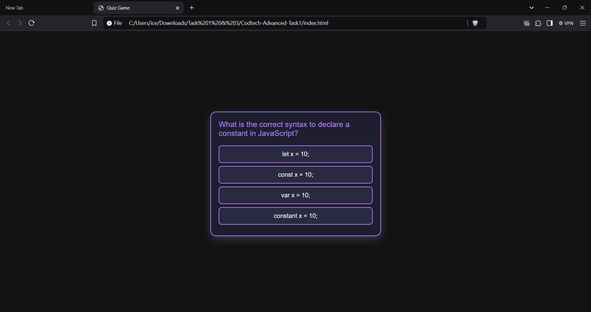
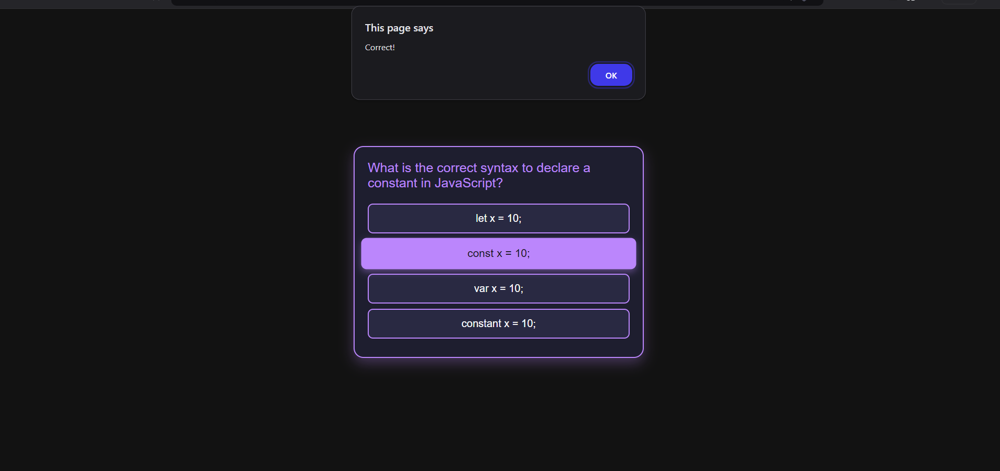

# Interactive Quiz Application Project

**Name**: Anurag Ganesh Tiwari

**Company**: CODTECH IT SOLUTIONS PVT.LTD

**ID**: CT08DQL

**Domain**: Frontend Web Development

**Duration**: Dec 12th 2024 to Jan 12th 2025

**Mentor**: [Mentor Name]

## Overview of the Project

**Project**: Interactive Quiz Application  

## Objective

The objective of this project is to create an engaging and interactive quiz application that allows users to test their knowledge on various topics. The quiz will include multiple-choice questions with a scoring system and a timer for each question. The goal is to provide an enjoyable and educational experience for users.

## Key Features

- **Multiple-Choice Questions**: A set of questions with four possible answers, where users can select their response.
- **Real-time Scoring**: Users receive instant feedback on whether their answer is correct, and their score is updated in real-time.
- **Timer**: Each question is timed, with the timer resetting for every new question.
- **Question Navigation**: Users can navigate between questions and view the overall quiz progress.
- **Progress Bar**: A visual progress bar to show how many questions have been completed and how many are left.
- **Result Screen**: After completing the quiz, users will see their total score and the correct answers for each question.

## Technologies Used

- **HTML5**: Structure and content layout of the quiz interface.
- **CSS3**: Styling and responsiveness.
  - Flexbox and Grid for layout management.
  - Google Fonts integration for clean typography.
  - Animations and transitions for smooth UI interactions.
- **JavaScript**: Core functionality of the quiz.
  - Dynamic rendering of quiz questions and options.
  - Timer implementation for each question.
  - Event handling for answer selection and navigation.
- **Libraries/Frameworks**:
  - Bootstrap for responsive design.
  - jQuery for DOM manipulation (optional).
  
## Implementation Details

1. **User Interface**:
   - A simple, user-friendly interface with a clean layout.
   - Display of the current question, options, and navigation buttons.
   - Real-time feedback on the selected answer (correct or incorrect).
   - Progress bar showing quiz completion percentage.
   - Timer for each question that resets with each new question.
   - End screen showing the total score and review of answers.

2. **Question Logic**:
   - Questions and options are dynamically loaded from a predefined set of data (could be from an API or JSON).
   - On selecting an answer, users are immediately notified if it’s correct or incorrect.
   - After answering a question, users can proceed to the next question.

3. **Timer Functionality**:
   - A countdown timer is implemented for each question.
   - If the timer expires, the user’s answer is automatically marked as incorrect, and they can move to the next question.
   - Timer resets with each new question.

4. **Scoring System**:
   - Users earn points for each correct answer.
   - After the quiz, users see their total score and can review the correct answers.

5. **Responsive Design**:
   - The quiz is fully responsive, with a mobile-friendly layout using Bootstrap and CSS media queries.
   - Flexbox and Grid are used for easy alignment and distribution of quiz elements.

## Future Enhancements

- **Leaderboard**: Display the top scores from users who have taken the quiz.
- **Quiz Categories**: Offer quizzes on different topics or allow users to choose categories before starting.
- **Timed Quizzes**: Add an overall timer for the entire quiz, and track how long it takes the user to complete the quiz.
- **Multiple Difficulty Levels**: Allow users to select difficulty levels (easy, medium, hard) for a more customized experience.
- **Question Review**: Let users review the questions they answered correctly and incorrectly after the quiz.
- **User Authentication**: Allow users to sign in, save their quiz scores, and track their progress over time.
- **Sharing Results**: Enable users to share their quiz results on social media platforms.
- **Question Creation**: Allow users to create and add their own questions to the quiz platform.

